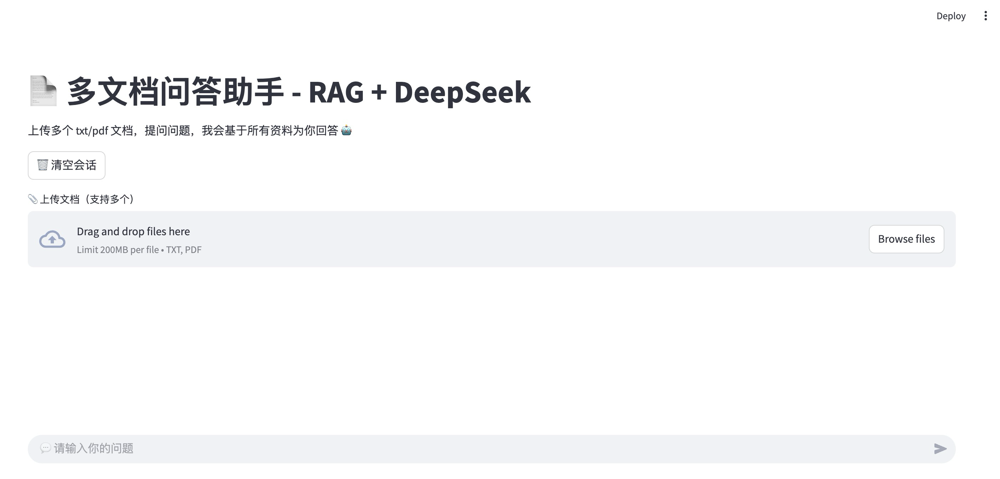

# 📄 多文档问答助手 - RAG + DeepSeek

本项目是一个基于 [LangChain](https://www.langchain.com/) 构建的 RAG（Retrieval-Augmented Generation）系统，结合 HuggingFace 向量嵌入 和 [DeepSeek](https://deepseek.com/) 大模型，实现了对多个 PDF/TXT 文件的智能问答。

用户可通过网页界面上传多个文档，并进行多轮中文问答。

## 🚀 功能亮点

- ✅ 支持上传多个 `.pdf` / `.txt` 文件
- ✅ 自动切分文档、向量化嵌入、构建本地知识库（使用 FAISS）
- ✅ DeepSeek 中文大模型回答问题（支持流式输出）
- ✅ 多轮对话上下文管理（基于 `st.session_state`）
- ✅ 无需本地部署大模型，适合轻量部署或学生学习

---

## 📦 安装依赖

创建虚拟环境后，安装：

```bash
pip install -r requirements.txt
```

## 🔑 环境变量配置
项目默认使用：
- DeepSeek API Key
- HuggingFace Hub API Token

你可以将它们直接写入代码
```bash
HUGGINGFACEHUB_API_TOKEN=hf_xxxxxxxxxxxxxxxxxxx
DEEPSEEK_API_KEY=sk_xxxxxxxxxxxxxxxxxxx
```

## ▶️ 运行项目
```bash
streamlit run rag_web_deepseek.py
```
默认在浏览器打开： http://localhost:8501

## 📁 项目结构
```
├── rag_web_deepseek.py     # 主程序
├── requirements.txt        # 所有依赖包
└── README.md               # 项目说明
```

## 📷 使用截图
打开后的页面如下，接下来可以开始愉快的对话啦！


## 🧠 使用技术

- [StreamlitLangChain](https://streamlit.io/)
- FAISS 向量库
- [DeepSeek](https://www.deepseek.com/)
- HuggingFace Embeddings

## 📄 License
[MIT License](LICENSE)

## ❤️ 致谢
本项目由本人和 ChatGPT 共同构建，感谢 DeepSeek 和 HuggingFace 社区的强大支持！
